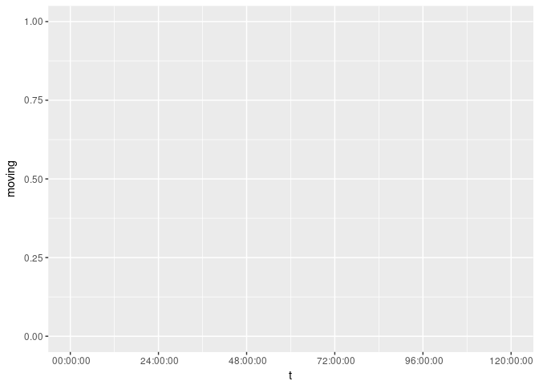
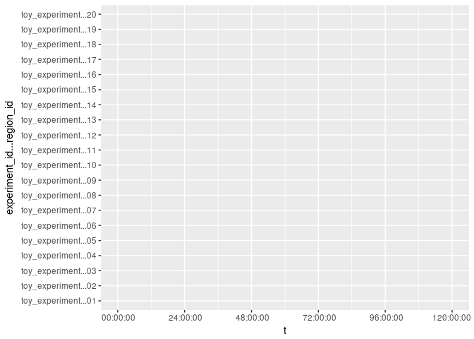
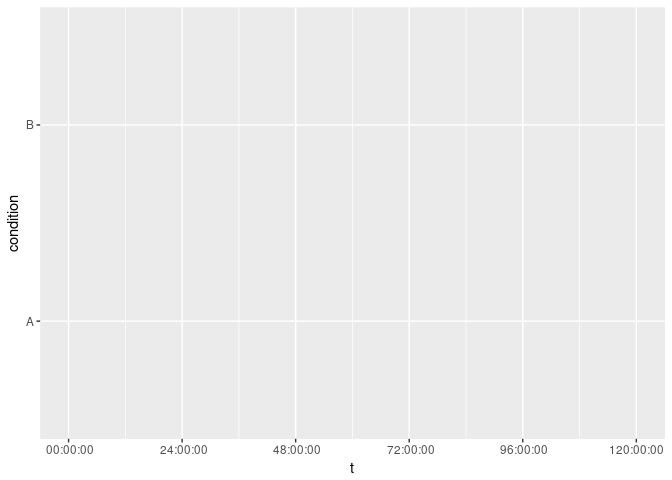
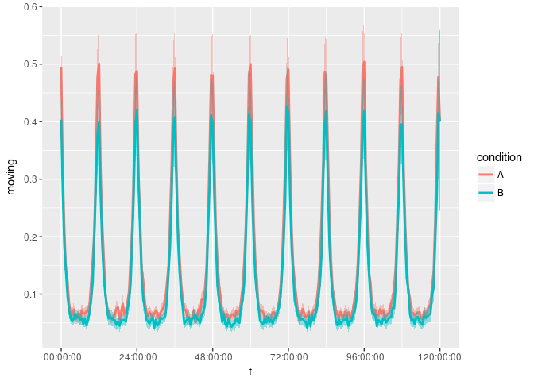
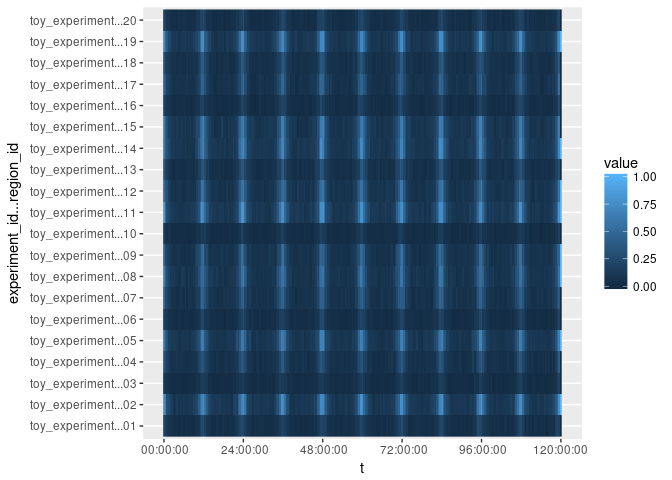
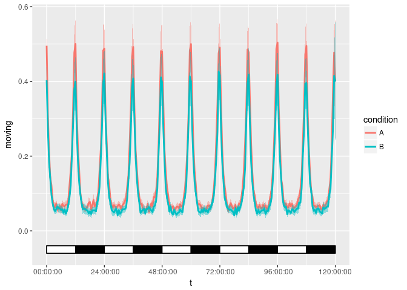
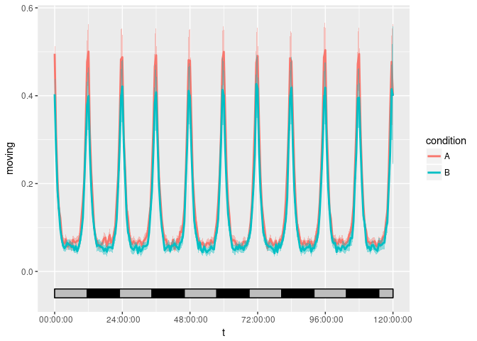
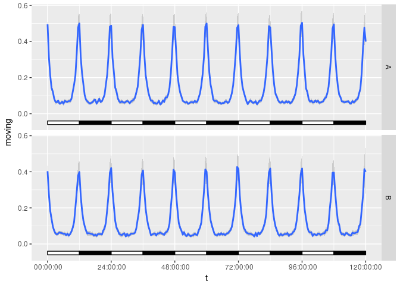
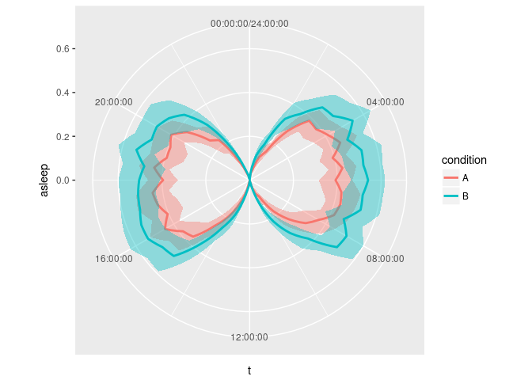

`ggetho` [](https://travis-ci.org/rethomics/ggetho)
======================================================================================================================================

<!-- [](https://ci.appveyor.com/project/tidyverse/hms)  -->
<!-- [](https://codecov.io/github/tidyverse/hms?branch=master) [](https://cran.r-project.org/package=hms) -->
`ggetho` is part of the [rethomics framework](todo.html). This README is a short explanation of the basics of `ggetho`. A [comprehensive documentation](todo.html) of rethomics is also available.

`ggetho`
--------

`ggetho` is built on top of [ggplot2](), which is a fantastic tool for visualising data in R. Ensure you understand the [basics of ggplot2]() before you go any further. `ggetho` provides a core function and a set of layers (that complement the ones offered by `ggplot`,):

-   `ggetho()` -- the core function
-   `stat_tile_etho()` -- to provide an overview plot
-   `stat_pop_etho()` -- to provide a population plot
-   `stat_ld_annotation()` -- to anontate any plot according to light/dark phases

This readme describes the very basics of each function. More examples are available in the [tutorials](todo.html).

Installation
------------

``` r
library(devtools)
install_github("rethomics/ggetho")
```

First steps
-----------

Let's simulate toy data (we call it `dt`) using `behavr` package. We "make"" 20 animals with two conditions and four age groups.

``` r
library(behavr)
library(ggetho)
```

    ## Loading required package: ggplot2

``` r
query<- data.frame(experiment_id="toy_experiment",
                   region_id=1:20,
                   condition=c("A","B"),
                   age=c(1, 5, 10, 20))
print(query)
```

    ##     experiment_id region_id condition age
    ## 1  toy_experiment         1         A   1
    ## 2  toy_experiment         2         B   5
    ## 3  toy_experiment         3         A  10
    ## 4  toy_experiment         4         B  20
    ## 5  toy_experiment         5         A   1
    ## 6  toy_experiment         6         B   5
    ## 7  toy_experiment         7         A  10
    ## 8  toy_experiment         8         B  20
    ## 9  toy_experiment         9         A   1
    ## 10 toy_experiment        10         B   5
    ## 11 toy_experiment        11         A  10
    ## 12 toy_experiment        12         B  20
    ## 13 toy_experiment        13         A   1
    ## 14 toy_experiment        14         B   5
    ## 15 toy_experiment        15         A  10
    ## 16 toy_experiment        16         B  20
    ## 17 toy_experiment        17         A   1
    ## 18 toy_experiment        18         B   5
    ## 19 toy_experiment        19         A  10
    ## 20 toy_experiment        20         B  20

``` r
dt <- toy_activity_data(query,seed=3)
dt
```

    ##                        id      t moving asleep
    ##      1: 01|toy_experiment      0  FALSE  FALSE
    ##      2: 01|toy_experiment     10  FALSE  FALSE
    ##      3: 01|toy_experiment     20  FALSE  FALSE
    ##      4: 01|toy_experiment     30  FALSE  FALSE
    ##      5: 01|toy_experiment     40  FALSE  FALSE
    ##     ---                                       
    ## 864016: 20|toy_experiment 431960   TRUE  FALSE
    ## 864017: 20|toy_experiment 431970  FALSE  FALSE
    ## 864018: 20|toy_experiment 431980  FALSE  FALSE
    ## 864019: 20|toy_experiment 431990  FALSE  FALSE
    ## 864020: 20|toy_experiment 432000  FALSE  FALSE

As you can see, in addition to the `id` column, which uniquely identify an animal, our data has three variables:

-   `t` -- the time
-   `moving` -- whether the animal is moving at that time
-   `asleep` -- whether the animal is asleep

Let our variable of interest be `moving` and we want `moving` (as a proportion) on the y axis (and implicitly, `t` is on the x axis). We also want different colours (`colour`) for each condition, then we would start by "translating" this verbal request to an object like this:

``` r
pl1 <- ggetho(dt, aes(y=moving, colour=condition))
pl1
```



Again, **this plot is empty** because no layer was added yet. Though it already knows the names and scale of the axis.

Sometimes, the variable of interest will not be on the y axis, instead, we want a colour intensity (z axis) to represent it in some sort of **tile plot**. *When unspecified, the y axis is discrete, and implies one row per individual animals.*

``` r
pl2 <- ggetho(dt, aes(z=moving))
pl2
```



Instead of having one row per animal, we may want to show a tile plot where populations of animals are **averaged** per condition, so `condition` is on the y axis, we have one row per condition and we show the variable of interest as a colour value:

``` r
pl3 <- ggetho(dt, aes(y=condition, z=moving))
pl3
```



As an appetiser, let's have a look at two layers we can use `stat_pop_etho()` and `stat_tile_etho()`.

`stat_pop_etho` shows the population average (and error bars), of the variable of interest (`y` axis):

``` r
pl1 + stat_pop_etho() 
```



`stat_tile_etho` shows the variable of interest on a coulour intensity `z` axis):

``` r
pl2 + stat_tile_etho() 
```



LD annotations
--------------

When studing biological rhythms, we often want to add to our plots information about the phase (light, L or dark, D). In `ggetho`, this can be done with `stat_ld_annotation()`:

``` r
pl1 + stat_pop_etho() + stat_ld_annotations()
```



Note that, LD annotations will also work on tile plot. the function comes with extra arguments. For instance, here, we replace the white by grey, and use a period of 23h instead of 24h:

``` r
pl1 + stat_pop_etho() + 
  stat_ld_annotations(ld_colours = c("grey","black"), period = hours(23))
```



Facets
------

Since the plot objects generated by `ggetho()` are compatible with `ggplot2`, you can use the same [faceting mechanism](http://ggplot2.tidyverse.org/reference/facet_grid.html). For example, we can make one subplot (row), for each level of `condition`.

``` r
pl1 <- ggetho(dt, aes(y=moving))
pl1 + stat_pop_etho() + stat_ld_annotations() +
  facet_grid( condition ~ .)
```



Coordinates and scales
----------------------

Sometimes, it can be interesting to show circadian data in a circular (polar) coordinate system:

``` r
pl4 <- ggetho(dt, aes(y=asleep, fill=condition), time_wrap = hours(24))
pl4 <- pl4 + stat_pop_etho() + coord_polar() 
pl4
```



Going further
-------------

-   [behavr](https://github.com/rethomics/behavr) -- to manipulate the data (create new variable/meta-variables)
-   [damr](https://github.com/rethomics/damr) -- to load data from the DAM2 system
-   [scopr](https://github.com/rethomics/scopr) -- to load data from the [ethoscope](http://gilestrolab.github.io/ethoscope/) system <!-- * [ggetho](https://github.com/rethomics/ggetho) -- to plot visualise the data -->
-   [sleepr](https://github.com/rethomics/sleepr) -- to perform sleep and circadian rythm analysis
